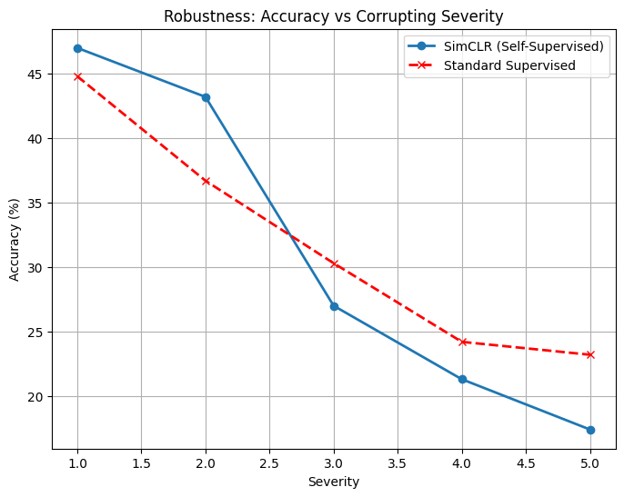
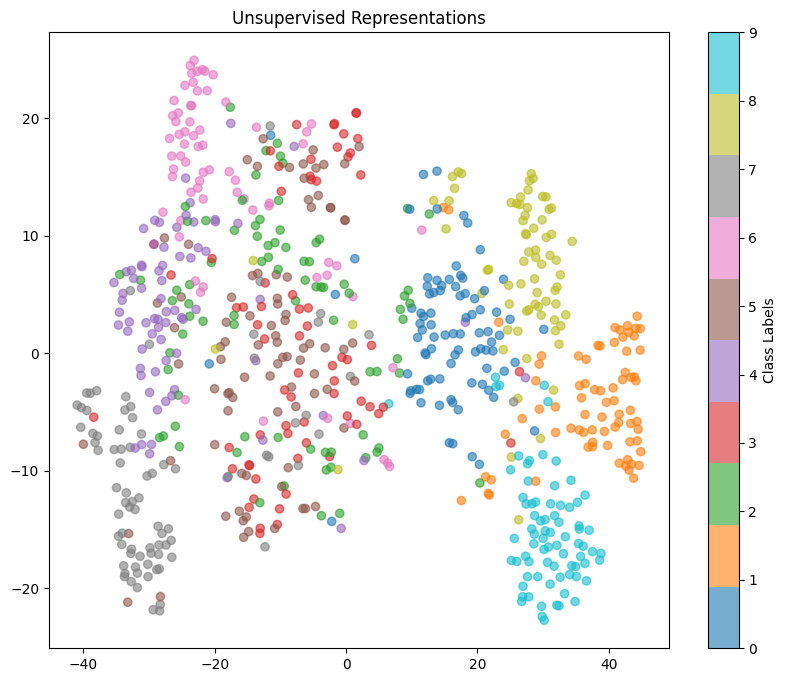

# Unsupervised (SimCLR) vs. Supervised: A Robustness Analysis

## Introduction
This project investigates the generalization capabilities of **Self-Supervised Learning (SimCLR)** compared to Standard Supervised Learning when subjected to out-of-distribution data.

Using a **ResNet-18** backbone trained on the CIFAR-10 dataset, we demonstrate that contrastive learning representations are inherently **more robust to image corruptions** (such as pixelation and blur) at lower severity levels than fully supervised models, even without being explicitly trained on noisy data.

---

## Repository Structure

| File / Folder | Description |
| :--- | :--- |
| `notebooks/` | Contains the full research pipeline (`SimCLR_Analysis.ipynb`) configured for Google Colab. |
| `saved_models/` | Models trained from scratch on CIFAR-10 for both the SimCLR backbone and Supervised baseline. |
| `results/` | Visualizations of robustness benchmarks and t-SNE feature clusters. |
| `imgclassfier_demos.py` | **Inference Script:** A standalone tool to test the model on your local images. |
| `requirements.txt` | List of dependencies required to run the project. |

---

## Key Results

### 1. Robustness Benchmark
The SimCLR model (Blue Line) maintains higher accuracy at **Severity Levels 1-2** compared to the Supervised baseline (Red Line), indicating stronger feature generalization.



### 2. Feature Space Visualization (t-SNE)
The t-SNE plot below shows the learned representations of the SimCLR backbone. The distinct, well-separated clusters confirm that the model learned semantic class structures (planes, cars, birds) without requiring explicit labels during pre-training.



---

## How to Run

### 1. Prerequisites
Clone the repository and install the required dependencies:
```bash
git clone [https://github.com/YOUR_USERNAME/Unsupervised-SimCLR-Robustness.git](https://github.com/YOUR_USERNAME/Unsupervised-SimCLR-Robustness.git)
cd Unsupervised-SimCLR-Robustness
pip install -r requirements.txt
```

### 2. Run the Demo
To test the model on your own images, run:
```bash
python imgclassfier_demos.py
```

### 3. Reproduce the training
The full training and evaluation logic is available in notebooks/SimCLR_Analysis.ipynb.
   
    Note: The notebook is designed to run in Google Colab and mounts Google Drive for storage.

---

## Methodology

Architecture: ResNet-18

Method: SimCLR (Simple Framework for Contrastive Learning)

Loss Function: NT-Xent (Normalized Temperature-scaled Cross Entropy Loss)

Augmentations: Random Crop, Color Jitter, Gaussian Blur (Training), Pixelate/Defocus (Testing)
